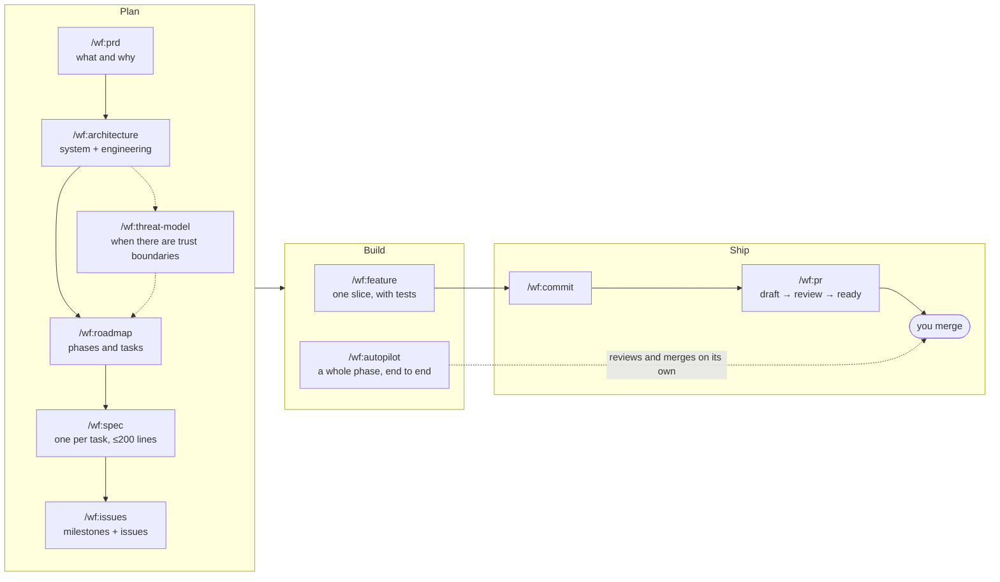

<h1 align="center">AI Workflow</h1>

<p align="center">
  <strong>A spec-driven, trunk-based delivery workflow for <a href="https://docs.anthropic.com/en/docs/claude-code">Claude Code</a>.</strong><br/>
  You decide <em>what</em> to build. Agents build it from the spec. A separate agent reviews it. You merge.
</p>

<p align="center">
  <a href="LICENSE"></a>
  <a href="CHANGELOG.md"></a>
  <a href="https://github.com/rafagomes/ai-workflow/issues"></a>
  <a href="https://github.com/rafagomes/ai-workflow/stargazers"></a>
</p>

<p align="center">
  <a href="#quick-start">Quick start</a> ·
  <a href="#how-it-works">How it works</a> ·
  <a href="#skills">Skills</a> ·
  <a href="#pick-your-path">Pick your path</a> ·
  <a href="#optional-global-conventions">Global conventions</a> ·
  <a href="#documentation">Docs</a>
</p>

---

## Quick start

Requires [Claude Code](https://docs.anthropic.com/en/docs/claude-code) and the [`gh`](https://cli.github.com) CLI.

```bash
claude plugin marketplace add rafagomes/ai-workflow
claude plugin install wf@ai-workflow
```

Then, in any project:

```
/wf:spec rate-limiting                           # write the spec, with verification criteria
/wf:feature rate-limiting                        # implement it, with tests
/wf:commit                                       # logical conventional commits
/wf:pr                                           # draft PR → independent review → ready
```

That is the whole loop. Everything else in this README is detail.

<sub>Inside a session the same install is `/plugin marketplace add rafagomes/ai-workflow` and `/plugin install wf@ai-workflow`. Update with `claude plugin update wf@ai-workflow`; remove with `claude plugin uninstall wf@ai-workflow`.</sub>

## What you get

| Piece | What it means |
|---|---|
| **15 skills** | One per step, from the first product interview to the merged pull request. All namespaced `/wf:<name>`. |
| **A reviewer agent** | Read-only and fresh-context. It runs the project's checks itself and returns `PASS` or `FIX_REQUIRED`. By default every PR goes through it before it is marked ready. |
| **Trunk-based by construction** | Short-lived branches, one PR per slice, slices of at most 200 non-test lines. [Why and how →](docs/TRUNK_BASED_WORKFLOW.md) |
| **Writer / reviewer separation** | The session that wrote the code never reviews it, and merging stays your decision unless you run `/wf:autopilot`. |
| **A session-start hook** | Fetches the remote and warns Claude when your branch is behind or has diverged, before any work starts. |
| **Optional global conventions** | A `CLAUDE.md` applied to every project: verification, commit style, the trunk rules, review before merge. |

## How it works

Documents flow downstream. Each skill reads what the previous ones wrote, so agents implement with full context instead of guessing.



`/wf:fix` works at any time, without a spec. `/wf:adr` records a decision whenever one is made. `/wf:design` and `/wf:verify-design` slot in before and during UI work.

### The review loop

`/wf:pr` does not hand you an unreviewed pull request:

1. Shows you the title and body, then pushes the branch and opens the PR as a **draft**.
2. Dispatches the `wf:reviewer` agent, which has never seen the code. It checks spec compliance, correctness, security at boundaries, test quality and convention drift, and runs the project's checks itself.
3. Fixes `HIGH` and `MED` findings and asks for a re-review — at most two cycles.
4. Marks the PR **ready** on `PASS`; `LOW` nits are listed but never block. If the loop does not converge, the PR stays a draft and you get the findings.

## Skills

### Plan

| Skill | Produces |
|---|---|
| `/wf:prd` | `docs/PRD.md` — an interview-driven product requirements document |
| `/wf:architecture` | `docs/ARCHITECTURE.md` — the system (components, data flow, stack, deployment) and how it is engineered (testing strategy, dev environment, CI/CD, coding standards) |
| `/wf:threat-model` | `docs/THREAT_MODEL.md` — a STRIDE-style threat model |
| `/wf:adr <title>` | `docs/adr/NNNN-<slug>.md` — an architecture decision record |
| `/wf:roadmap` | `docs/roadmap/NNN_<phase>.md` — a phased roadmap, one file per phase |
| `/wf:spec <feature>` | `docs/specs/NNN_<feature>.md` — a spec with verification criteria, sliced when it exceeds 200 source lines |
| `/wf:issues <roadmap or spec>` | GitHub milestones and issues — one milestone per phase, one issue per task or slice |

### Design

| Skill | Does |
|---|---|
| `/wf:design [flow]` | Design system, brand guide and screens in Paper (needs the Paper MCP) |
| `/wf:verify-design [page]` | Diffs the running UI against the Paper artboards with Playwright and fixes mismatches in place |

### Build

| Skill | Does |
|---|---|
| `/wf:feature <spec>` | Implements one spec or slice with tests, runs the checks, and stops at the working tree. `--commit` also commits; `--pr` also opens the PR and runs its review |
| `/wf:fix <description or issue>` | Root-cause diagnosis, minimal fix, regression test |
| `/wf:autopilot [roadmap or phase file]` | Delivers a roadmap, a phase (`--phase <NNN>`) or a GitHub milestone (`--milestone <N>`): each task is developed in a worktree, reviewed in a fresh context, fixed, and **merged to `main`**. `--supervised` leaves the PRs open for you; `--dry-run` prints the plan. Runs only when you type it |
| `/wf:new-project <name> [stack]` | Scaffolds a repo: `CLAUDE.md`, Makefile, linter and pre-commit config, lint hook, docs skeleton |

### Ship

| Skill | Does |
|---|---|
| `/wf:commit` | Splits the working tree into logical conventional commits. Local only |
| `/wf:pr [--draft] [--no-review]` | Opens a draft PR, has `wf:reviewer` review it, fixes the findings, marks it ready |

> [!NOTE]
> There is no review skill. To review someone else's branch or PR, use Claude Code's built-in `/code-review`; for a security pass, the built-in `/security-review`.

## Pick your path

Not every change needs every step.

| You have… | Run |
|---|---|
| A bug | `/wf:fix` → `/wf:commit` → `/wf:pr` |
| A small, well-understood change | `/wf:spec` → `/wf:feature` → `/wf:commit` → `/wf:pr` |
| A feature larger than one PR | `/wf:spec` (it slices) → `/wf:issues` → `/wf:feature` per slice |
| A new project | `/wf:new-project` → `/wf:prd` → `/wf:architecture` → `/wf:threat-model` → `/wf:roadmap` → `/wf:spec` per task |
| An inherited codebase with no docs | `/wf:architecture` first — it explores the code and asks you to confirm what it found — then `/wf:threat-model` if needed, then specs as you go |
| A planned phase to deliver unattended | `/wf:autopilot --phase <NNN>` (add `--supervised` to keep the merge) |
| A decision worth remembering | `/wf:adr` |

## Optional: global conventions

A plugin cannot ship a global `CLAUDE.md` or user settings. To get those, clone the repo and run the installer:

```bash
git clone https://github.com/rafagomes/ai-workflow.git
cd ai-workflow
./install.sh
```

It symlinks two files into `~/.claude/`. A file already there is moved to `<name>.bak.<timestamp>` first:

| Installed as | What it is |
|---|---|
| `~/.claude/CLAUDE.md` | Conventions applied to every project: verify before claiming done, conventional commits split by concern, spec first, a fresh reviewer for every branch, human-gated merges, the trunk rules |
| `~/.claude/settings.json` | Your settings, seeded from `settings.example.json` on first run and never tracked. The seed holds a desktop-notification hook and a plugin list (`wf` plus a handful of official plugins) with this repo registered as a marketplace. It sets no permission mode and no model — read it before the first run |

`./uninstall.sh` removes the symlinks that point into this clone and restores the backups.

<details>
<summary><strong>Installer flags</strong></summary>

<br/>

| Flag | Effect |
|---|---|
| `--no-settings` | Leave `settings.json` alone |
| `--with-settings` | Link `settings.json` even into a secondary profile |
| `--extra` | Also link the personal skills under `extras/` |

</details>

<details>
<summary><strong>Multiple Claude Code profiles</strong></summary>

<br/>

Claude Code isolates profiles through `CLAUDE_CONFIG_DIR`. Point `CLAUDE_DIR` at a profile to install into it:

```bash
CLAUDE_DIR="$HOME/.claude-work" ./install.sh
```

A secondary profile keeps its own `settings.json` — account, theme, model and enabled plugins are the reason to have separate profiles — so only the primary `~/.claude` gets the repo's file unless you pass `--with-settings`. The plugin is installed per profile too: run the `claude plugin` commands with `CLAUDE_CONFIG_DIR` set.

</details>

<details>
<summary><strong>Upgrading from the symlink-based install (before 1.0)</strong></summary>

<br/>

Skills used to be symlinked into `~/.claude/skills/` and invoked by bare name (`/feature`). They now come from the plugin (`/wf:feature`).

1. `git pull` in your existing clone, at the path the old links point to.
2. `./uninstall.sh` — it sweeps the old skill, agent, command and review-guide symlinks and the `aiwf` launcher. It only removes links into its own clone.
3. `./install.sh`, then install the plugin as in [Quick start](#quick-start).

| Before | Now |
|---|---|
| `/factory <phase>` | `/wf:autopilot --phase <NNN> --supervised` |
| `/tdd` | `/wf:architecture` |
| `/security` | `/wf:threat-model` |
| `/review` | built-in `/code-review` |
| `/sec-review` | built-in `/security-review` |
| `aiwf update` | `claude plugin update wf@ai-workflow` |

</details>

## Under the hood

<details>
<summary><strong>The reviewer agent</strong></summary>

<br/>

`wf:reviewer` reviews a branch diff against its spec: spec compliance, correctness, security at boundaries, test quality, convention drift. It is read-only, runs the project's checks itself rather than trusting the writer's output, and returns `PASS` or `FIX_REQUIRED` with `HIGH` / `MED` / `LOW` findings. `/wf:pr` and `/wf:autopilot` dispatch it.

</details>

<details>
<summary><strong>The session-start hook</strong></summary>

<br/>

When a session starts in a git repository whose branch tracks a remote, the hook runs `git fetch` on that remote and, only if the branch is behind or has diverged, tells Claude so before any work begins. It prints nothing otherwise, never prompts for credentials, and gives up quietly when the remote is unreachable.

</details>

<details>
<summary><strong>Repository layout</strong></summary>

<br/>

```
ai-workflow/
├── .claude-plugin/
│   ├── plugin.json            # The wf plugin manifest
│   └── marketplace.json       # Lets this repo be added as a marketplace
├── skills/<name>/SKILL.md     # The 15 skills
├── agents/reviewer.md         # The reviewer agent
├── hooks/                     # SessionStart hook: fetch and report a stale branch
├── dotfiles/CLAUDE.md         # Global conventions (symlinked to ~/.claude/CLAUDE.md)
├── settings.example.json      # Seed for your untracked settings.json
├── install.sh / uninstall.sh  # Symlink the two personal files above
├── extras/                    # Opt-in personal skills (./install.sh --extra)
├── CLAUDE.md                  # Rules for working IN this repo (not installed)
└── docs/
    ├── TRUNK_BASED_WORKFLOW.md
    └── SKILL_QUALITY.md
```

The repo-root `CLAUDE.md` holds the rules for working inside this repo. It is not the global one and is not installed.

</details>

<details>
<summary><strong>Modifying the toolkit</strong></summary>

<br/>

Edit the sources in this repo, never the installed copies. To try a change before publishing it, load the working tree as the plugin for one session:

```bash
claude --plugin-dir /path/to/ai-workflow
```

`claude plugin validate .` checks the manifests and every skill and agent definition. `dotfiles/CLAUDE.md` is symlinked, so edits to it apply immediately.

</details>

## Documentation

| Document | About |
|---|---|
| [Trunk-Based Workflow](docs/TRUNK_BASED_WORKFLOW.md) | Why and how the toolkit enforces trunk-based development — rules, recipes, FAQ |
| [Skill Quality](docs/SKILL_QUALITY.md) | How skills are benchmarked before and after changes |
| [Changelog](CHANGELOG.md) | What changed in each version |
| [Contributing](CONTRIBUTING.md) · [Security](SECURITY.md) · [Code of Conduct](CODE_OF_CONDUCT.md) | Project policies |

**Related:** [claude-code-mods](https://github.com/rafagomes/claude-code-mods) — optional mods for the Claude Code interface (`english-coach`, `toolbar`) and the status line that used to ship here, installed separately.

## License

[MIT](LICENSE) — Rafa Gomes
