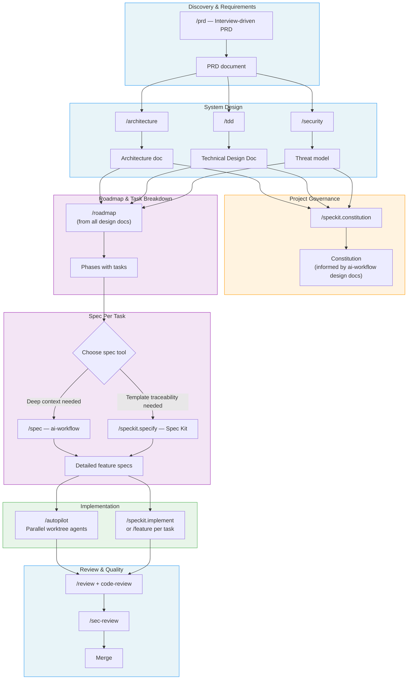
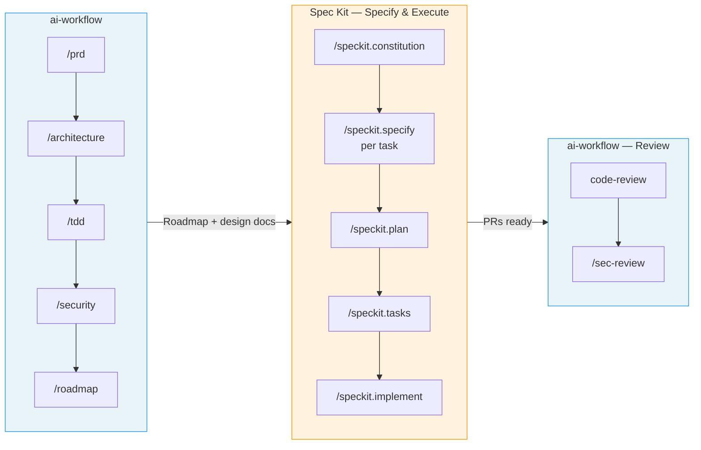
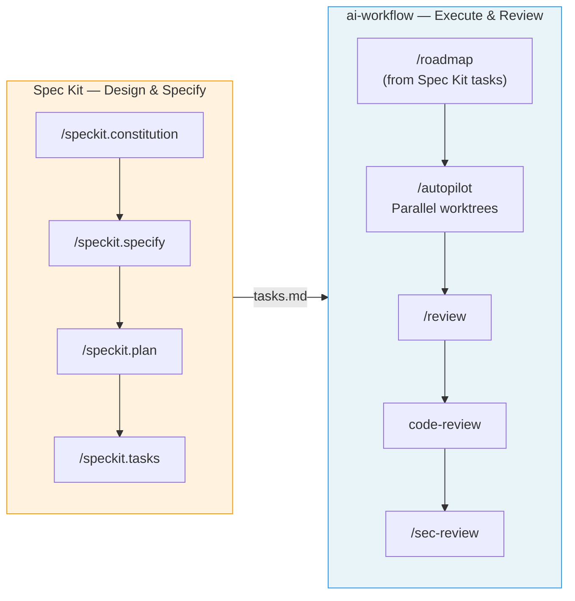
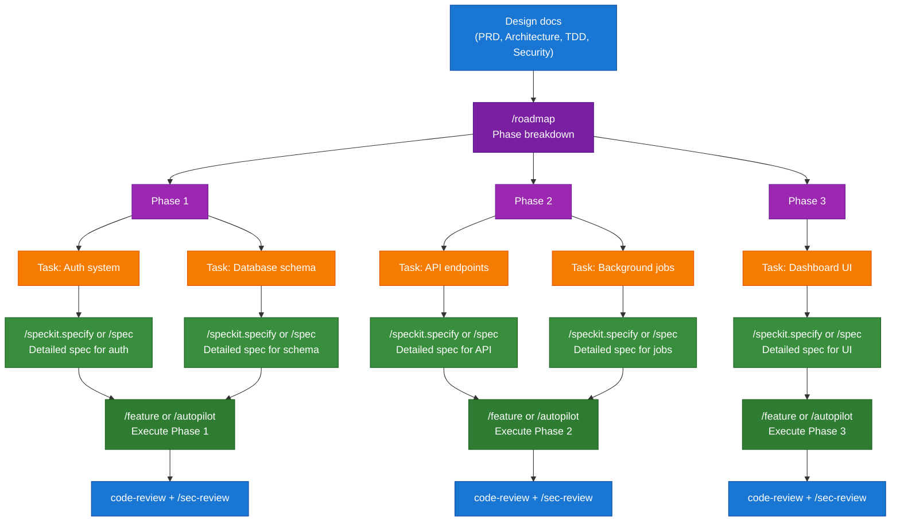
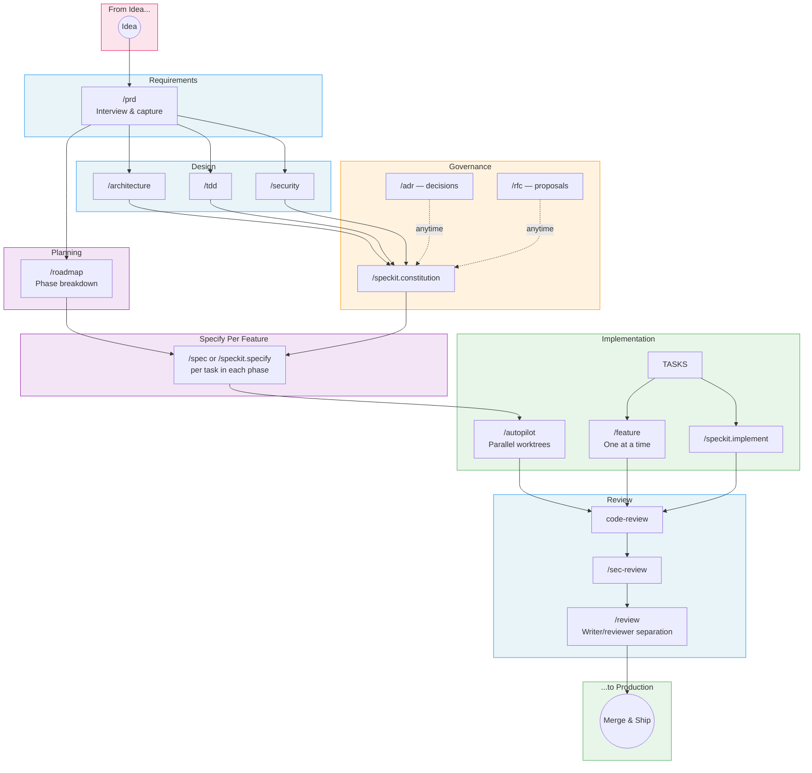

# Using ai-workflow with GitHub Spec Kit

ai-workflow and [GitHub Spec Kit](https://github.com/github/spec-kit) solve overlapping problems from different angles. This guide shows how to combine them into a single workflow that plays to each tool's strengths.

## Where Each Tool Shines

| Phase | ai-workflow | Spec Kit |
|-------|-------------|----------|
| **Requirements** | Deep interview-driven PRDs (`/prd`) | Structured spec templates (`/speckit.specify`) |
| **Principles** | Global conventions via `CLAUDE.md` | Project constitution (`/speckit.constitution`) |
| **Architecture** | Dedicated architecture docs (`/architecture`) | Embedded in implementation plan (`/speckit.plan`) |
| **Technical design** | Dedicated TDD docs — testing, dev env, CI/CD, standards (`/tdd`) | Test-first enforcement via constitution articles |
| **Threat modeling** | Dedicated security docs + agents (`/security`) | Available via community extensions |
| **Feature specs** | `/spec` with verification criteria | `/speckit.specify` with acceptance criteria |
| **Task breakdown** | `/roadmap` with phase dependencies | `/speckit.tasks` with parallelization markers |
| **Implementation** | `/feature`, `/autopilot` with worktrees | `/speckit.implement` |
| **Code review** | `/review` (writer/reviewer), `/sec-review`, plus Anthropic's `code-review` skill with language guides from `reviews/` | Community extensions |
| **Security review** | Dedicated agents + `/sec-review` | Community extensions |
| **Governance** | `/adr`, `/rfc` at any point | Constitution amendments |

**ai-workflow** is deeper on design, review, and parallel execution.
**Spec Kit** is stronger on structured templates, traceability, and agent-agnostic portability.

Together, they cover the full lifecycle without gaps.

## Combined Workflow



## The Three Integration Patterns

Depending on your team and project, you can integrate at different levels.

### Pattern 1: ai-workflow for design, Spec Kit for execution

Best for: teams that want deep upfront design with structured, traceable task execution.



**Steps:**

1. `/prd` — interview and capture requirements
2. `/architecture` + `/tdd` + `/security` — design the system (architecture, technical design, threat model)
3. `/roadmap` — break the design into phased tasks from all available design docs
4. `/speckit.constitution` — encode architecture decisions and coding standards as constitutional articles
5. `/speckit.specify` — create detailed, traceable specs for each task in the roadmap
6. `/speckit.plan` — technical implementation plan per spec
7. `/speckit.tasks` + `/speckit.implement` — execute
8. `code-review` + `/sec-review` — review with language-aware agents

**Why this works:** ai-workflow's interview-driven design phase produces richer context than going straight to Spec Kit templates. The roadmap gives structure *before* detailed specs exist. Then Spec Kit's constitutional compliance and task traceability keep specification and implementation disciplined. ai-workflow's review agents catch what CI can't.

---

### Pattern 2: Spec Kit for structure, ai-workflow for power

Best for: teams that like Spec Kit's template discipline but need ai-workflow's parallel execution and deep review. In this pattern, Spec Kit leads the design and specification — ai-workflow takes over for phased execution and review.



**Steps:**

1. `/speckit.constitution` — establish project principles
2. `/speckit.specify` — create structured feature specs (Spec Kit leads here)
3. `/speckit.plan` — technical implementation plan
4. `/speckit.tasks` — generate task list with `[P]` parallelization markers
5. `/roadmap` — convert Spec Kit tasks into phased roadmap with dependencies
6. `/autopilot` — execute the roadmap with parallel worktree agents
7. `/review` + `code-review` + `/sec-review` — full review pipeline

**Why this works:** Spec Kit's templates enforce structure that prevents vague specs. ai-workflow's `/roadmap` then phases those tasks with dependency ordering, and `/autopilot` runs them in parallel across isolated worktrees — something Spec Kit's `/speckit.implement` does sequentially.

---

### Pattern 3: Cherry-pick the best of each

Best for: solo developers or small teams that want flexibility.

Pick the tool that fits each phase:

| Phase | Recommended | Why |
|-------|-------------|-----|
| Requirements | `/prd` (ai-workflow) | Interactive interview surfaces edge cases better than filling templates |
| Principles | `/speckit.constitution` (Spec Kit) | Constitutional articles are more enforceable than CLAUDE.md conventions |
| Architecture | `/architecture` (ai-workflow) | Dedicated doc is easier to reference than embedded plan sections |
| Technical design | `/tdd` (ai-workflow) | Separate doc covers testing, dev env, CI/CD, and coding standards |
| Roadmap | `/roadmap` (ai-workflow) | Generates phased tasks from all available design docs before detailed specs exist |
| Feature spec | Either — depends on the feature | Use `/spec` for complex features needing deep context; `/speckit.specify` for well-understood features needing traceability |
| Task breakdown | `/speckit.tasks` (Spec Kit) | Better traceability with `[P]` markers and spec references |
| Implementation | `/autopilot` (ai-workflow) | Parallel worktree execution is faster for multi-task phases |
| Code review | Anthropic's `code-review` skill + ai-workflow's language guides in `reviews/` | Language-specific review guides are deeper |
| Security review | `/sec-review` (ai-workflow) | Dedicated parallel analysis agents |
| Governance | `/adr` (ai-workflow) | Lightweight and can be created at any point |

---

## Setting Up Both Tools

### Install ai-workflow

```bash
git clone https://github.com/0xrafasec/ai-workflow.git
cd ai-workflow
./install.sh
```

### Install Spec Kit

```bash
uv tool install specify-cli --from git+https://github.com/github/spec-kit.git@v0.1.4
```

Then initialize in your project:

```bash
cd your-project
specify init .
```

### Connecting the Design Docs

When running `/speckit.constitution`, reference the ai-workflow design docs:

```
Create the project constitution. Use these documents as input:
- Architecture: docs/architecture.md
- Technical design: docs/tdd.md
- Security: docs/security.md

Encode the key decisions from these documents as constitutional articles.
```

When running `/speckit.plan`, reference the feature spec:

```
/speckit.plan

Use the feature spec at docs/specs/feature-name.md as the primary input.
The architecture is defined in docs/architecture.md.
```

### Feeding Spec Kit Tasks into ai-workflow

Convert `tasks.md` into a roadmap:

```
/roadmap

Read the tasks from .speckit/features/NNN-feature-name/tasks.md.
Group them into phases based on dependencies.
Tasks marked [P] can run in parallel within the same phase.
```

Then execute:

```
/autopilot docs/roadmap/001_feature-name.md
```

### Roadmap → Specify Per Feature

The most natural integration point: use ai-workflow for the high-level phases, then Spec Kit (or `/spec`) to detail each feature before execution.



**The flow:**

1. `/prd` — capture product requirements through an interview
2. `/roadmap` — break the PRD into phased work (even without detailed specs yet)
3. **Per task in each phase:** run `/spec <task-name>` or `/speckit.specify` to create a detailed, traceable spec
4. `/autopilot` (or `/feature`) — execute the phase, now that every task has a spec
5. `code-review` + `/sec-review` — review before merging

**Why this matters:** You don't always have detailed specs upfront. Often you have a PRD and a rough idea of phases. The roadmap gives you structure and ordering; then you specify each task *just before* implementing it, with the full roadmap context available. This avoids specifying tasks that might change as earlier phases are completed.

**When to specify all upfront vs. per-phase:**

| Approach | When to use |
|----------|-------------|
| Specify all tasks before starting | Small project, well-understood domain, stable requirements |
| Specify per phase (just-in-time) | Large project, evolving requirements, later phases depend on learnings from earlier ones |
| Mix — specify Phase 1 fully, others loosely | Most common — get started fast, refine as you learn |

## Lifecycle Overview



## When to Use Which

| Scenario | Recommendation |
|----------|---------------|
| Greenfield project, solo developer | ai-workflow only — less setup, full lifecycle |
| Team with mixed AI tools (Copilot, Cursor, Claude) | Spec Kit for specs + planning (agent-agnostic), ai-workflow for implementation + review (Claude Code) |
| Existing Spec Kit project, want better reviews | Add ai-workflow's `/review` + `/sec-review`, plus Anthropic's `code-review` skill with this repo's `reviews/` guides |
| Existing ai-workflow project, want better traceability | Add Spec Kit's `/speckit.constitution` and `/speckit.tasks` |
| Large project, many parallel features | Both — Spec Kit for structure, ai-workflow `/autopilot` for execution |
| Compliance-heavy project | Both — Spec Kit constitution for enforcement, ai-workflow `/sec-review` for auditing |
